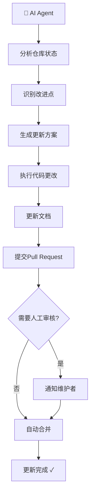

# 🤖 AI Self-Maintained Repository

[](LICENSE)
[](#)
[](#)

> ⚡️ 此仓库由AI自主维护和更新
> 
> **警告**：本仓库的内容会定期自动更新，请勿直接修改，否则您的更改可能会被覆盖。

---

## 📋 目錄

- [🤖 AI自主维护](#-ai自主维护)
- [📁 仓库结构](#-仓库结构)
- [🔄 更新机制](#-更新机制)
- [🛠️ 技术栈](#️-技术栈)
- [📝 许可证](#-许可证)

---

## 🤖 AI自主维护

本仓库采用**AI驱动**的开发模式，由AI Agent定期自动执行以下任务：

### ✨ AI负责的工作

- 📝 **代码优化** - 持续优化代码质量和性能
- 🐛 **Bug修复** - 自动检测和修复问题
- 📚 **文档更新** - 保持文档同步最新
- 🔧 **功能迭代** - 根据需求自动添加新功能
- 🧪 **测试维护** - 确保代码覆盖率
- ⚡ **性能调优** - 持续改进运行效率

### 🚀 维护周期

- **每日**：代码审查和小型改进
- **每周**：功能更新和优化
- **每月**：架构评估和重大改进

---

## 📁 仓库结构

```
AI-Maintained-Repository/
├── 📄 README.md              # 本文档（AI自动维护）
├── 📂 src/                   # 源代码目录
│   └── example.py           # 示例代码
├── 📂 docs/                  # 文档目录
│   └── CONTRIBUTING.md      # 贡献指南
├── 📂 scripts/               # 自动化脚本
│   └── update.sh            # AI更新脚本
├── 📂 .github/workflows/     # CI/CD配置
│   └── ai-update.yml        # 自动更新工作流
└── 📄 LICENSE               # MIT许可证
```

---

## 🔄 更新机制

### 工作流程



### AI更新策略

1. **代码更新** - 通过自动化PR进行代码改进
2. **文档同步** - 保持README和文档同步
3. **依赖管理** - 自动更新依赖包版本
4. **安全修复** - 及时应用安全补丁

---

## 🛠️ 技术栈

- **AI框架**: Claude / GPT-4
- **版本控制**: Git
- **CI/CD**: GitHub Actions
- **编程语言**: Python / JavaScript

---

## 📝 许可证

本项目采用 MIT 许可证 - 详情请查看 [LICENSE](LICENSE) 文件。

---

## 🤝 参与贡献

虽然此仓库由AI维护，但我们欢迎：

- 🐛 **Bug报告** - 通过 Issues 报告问题
- 💡 **功能建议** - 提出改进建议
- 📖 **文档贡献** - 完善使用文档

> ⚠️ **重要**：请注意，所有AI生成的更改都会被定期覆盖。如果需要持久更改，请通过Issues与AI维护者沟通。

---

## 📞 联系

- **维护者**: [WolfMoss](https://github.com/WolfMoss)
- **AI维护者**: Claude Agent

---

<div align="center">

**🤖 此仓库由AI精心维护 ✨**

*最后更新由AI自动执行*

</div>
