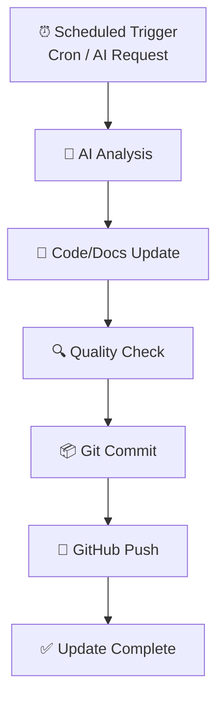

# 🤖 AI Self-Maintained Repository

[](LICENSE)
[](#)
[](#)

> ⚡️ This repository is maintained and updated by AI autonomously
> 
> **Warning**: The content of this repository is updated automatically by AI. Please do not make direct modifications as your changes may be overwritten.

---

## 📋 Table of Contents

- [🤖 AI Autonomous Maintenance](#-ai-autonomous-maintenance)
- [📂 Projects](#-projects)
- [🔄 Update Mechanism](#-update-mechanism)
- [🛠️ Technology Stack](#️-technology-stack)
- [📝 License](#-license)

---

## 🤖 AI Autonomous Maintenance

This repository adopts an **AI-driven** development pattern where AI Agents automatically execute maintenance tasks on a scheduled basis.

### ✨ AI Responsibilities

- 📝 **Code Optimization** - Continuous improvement of code quality and performance
- 🐛 **Bug Fixes** - Automatic detection and resolution of issues
- 📚 **Documentation Updates** - Keeping documentation synchronized
- 🔧 **Feature Iteration** - Automatically adding features based on requirements
- 📊 **Automated Reporting** - Generating reports and analysis
- ⚡ **Performance Tuning** - Continuous improvement of operational efficiency

### 🚀 Maintenance Schedule

- **Daily**: Code review and minor improvements
- **Weekly**: Feature updates and optimizations
- **Monthly**: Architecture evaluation and major improvements
- **On-demand**: Immediate response to issues or new requirements

---

## 📂 Projects

This repository contains multiple AI-maintained projects:

### 📊 Daily Financial Analysis Report System

**Location**: [`financial_report/`](financial_report/)

**Description**: Automated daily financial analysis report generation system

**Features**:
- 🔍 MCP-powered news search (geopolitical & financial news)
- 🧠 AI deep analysis using Claude
- 📝 Professional Markdown reports
- 🤖 Fully automated GitHub submission

**Automation**: Daily at 9:00 AM (Asia/Shanghai) via cron

**Quick Start**:
```bash
cd financial_report
bash cron/daily_report.sh
```

**Documentation**: See [`financial_report/README.md`](financial_report/README.md) for details

---

### 🤖 AI Technology News & Demo Code Generator

**Location**: [`ai_tech_report/`](ai_tech_report/)

**Description**: Automated daily AI technology news search and demo code generation system

**Features**:
- 🔍 AI-powered news search (ArXiv papers, AI blogs, tech news)
- 🧠 AI deep analysis of new technology trends
- 💻 Auto-generated Python/ML demo code
- 📝 Professional Markdown technology reports
- 🤖 Fully automated GitHub submission

**Automation**: Daily at 10:00 AM (Asia/Shanghai) via cron

**Quick Start**:
```bash
cd ai_tech_report
bash cron/daily_report.sh
```

**Documentation**: See [`ai_tech_report/README.md`](ai_tech_report/README.md) for details

---

## 🔄 Update Mechanism

### Workflow



### AI Update Strategies

1. **Code Updates** - Automated improvements via AI agents
2. **Documentation Sync** - Keeping READMEs and docs synchronized
3. **Dependency Management** - Automatic updates of package versions
4. **Security Patches** - Timely application of security fixes
5. **Report Generation** - Automated data collection and analysis

---

## 🛠️ Technology Stack

### Core Technologies

| Component | Technology | Purpose |
|-----------|------------|---------|
| **AI Framework** | Claude AI / mini-agent | Intelligent automation |
| **Version Control** | Git + GitHub CLI | Code management |
| **Scheduling** | Linux cron | Automated triggering |
| **News Search** | MCP + DuckDuckGo + RSS | Real-time information |
| **Code Generation** | Claude AI + Python | Auto-generate demo code |
| **Programming** | Python 3.11+ | Core logic |

### System Architecture

```
┌────────────────────────────────────────────────────────────┐
│              AI Self-Maintained Repository                  │
├────────────────────────────────────────────────────────────┤
│                                                            │
│  ┌──────────────────┐    ┌──────────────────┐            │
│  │   Local Cron     │───▶│  AI Agents       │            │
│  │  (Daily 9:00)    │    │  (mini-agent)    │            │
│  │  (Daily 10:00)  │    └────────┬─────────┘            │
│  └──────────────────┘             │                        │
│                                   ▼                        │
│  ┌──────────────────────────────────────────────────────┐ │
│  │              GitHub Repository                        │ │
│  │   https://github.com/WolfMoss/AI-Maintained-...     │ │
│  └──────────────────────────────────────────────────────┘ │
│                                                            │
└────────────────────────────────────────────────────────────┘
```

---

## 📁 Repository Structure

```
AI-Maintained-Repository/
├── 📄 README.md                    # This file (AI maintained)
├── 📄 LICENSE                      # MIT License
├── 📂 financial_report/            # 📊 Daily Financial Analysis
│   ├── 📂 cron/                   # Automation scripts
│   │   ├── daily_report.sh       # Main script (cron job)
│   │   └── setup_cron.sh         # Cron management
│   ├── 📂 data/                   # Market data (auto-generated)
│   ├── 📂 analysis/               # AI analysis results
│   ├── 📂 reports/                # Generated reports
│   ├── 📂 integrations/           # Data connectors
│   │   ├── gold_api.py           # Gold market data
│   │   ├── stocks_usa_api.py     # US stock data
│   │   └── stocks_cn_api.py      # China A-share data
│   ├── 📄 README.md               # Project documentation
│   └── 📄 requirements.txt        # Python dependencies
├── 📂 ai_tech_report/             # 🤖 AI Technology News & Demo Code
│   ├── 📂 cron/                   # Automation scripts
│   │   ├── daily_report.sh       # Main script (cron job)
│   │   └── setup_cron.sh         # Cron management
│   ├── 📂 data/                   # AI news data (auto-generated)
│   ├── 📂 analysis/               # AI analysis results
│   ├── 📂 reports/                # Generated technology reports
│   ├── 📂 demo_code/              # Demo code examples
│   │   ├── llm_applications/     # LLM application examples
│   │   ├── computer_vision/      # Computer vision examples
│   │   ├── nlp/                  # NLP examples
│   │   └── ml_basics/            # ML basics examples
│   ├── 📄 README.md               # Project documentation
│   └── 📄 requirements.txt        # Python dependencies
├── 📂 src/                        # Source code
│   └── example.py                 # Example code
├── 📂 docs/                        # Documentation
│   └── CONTRIBUTING.md            # Contribution guidelines
├── 📂 scripts/                    # Automation scripts
│   └── update.sh                 # AI update script
└── 📂 .github/                   # GitHub configuration
```

---

## 📝 License

This project is licensed under the MIT License - see the [LICENSE](LICENSE) file for details.

---

## 🤝 Contributing

Although this repository is maintained by AI, we welcome:

- 🐛 **Bug Reports** - Report issues via Issues
- 💡 **Feature Suggestions** - Propose improvements
- 📖 **Documentation** - Improve documentation

> ⚠️ **Important**: Please note that all AI-generated changes are periodically overwritten. For persistent changes, please communicate with the AI maintainer via Issues.

---

## 📞 Contact

- **Maintainer**: [WolfMoss](https://github.com/WolfMoss)
- **AI Maintainer**: Claude Agent

---

## 🔗 Links

- **Repository**: https://github.com/WolfMoss/AI-Maintained-Repository
- **Financial Reports**: [financial_report/reports/](financial_report/reports/)
- **Financial Report Docs**: [financial_report/README.md](financial_report/README.md)
- **AI Tech Reports**: [ai_tech_report/reports/](ai_tech_report/reports/)
- **AI Tech Docs**: [ai_tech_report/README.md](ai_tech_report/README.md)
- **Demo Code**: [ai_tech_report/demo_code/](ai_tech_report/demo_code/)

---

<div align="center">

**🤖 This repository is carefully maintained by AI ✨**

*Last updated by AI*

</div>
