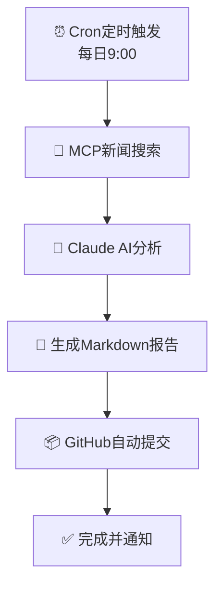

# 🤖 AI自主维护仓库 - 每日金融分析系统

[](LICENSE)
[](#)
[](#)
[](#)

> ⚡️ 此仓库由AI自主维护和更新
> 
> **核心功能**：每日自动搜索全球金融新闻，使用AI进行深度分析并生成专业报告
> 
> **警告**：本仓库的内容会定期自动更新，请勿直接修改，否则您的更改可能会被覆盖。

---

## 📋 目录

- [🤖 AI自主维护](#-ai自主维护)
- [📊 每日金融分析系统](#-每日金融分析系统)
- [🏗️ 系统架构](#-系统架构)
- [📁 仓库结构](#-仓库结构)
- [🔄 更新机制](#-更新机制)
- [🛠️ 技术栈](#-技术栈)
- [📝 许可证](#-许可证)

---

## 🤖 AI自主维护

本仓库采用**AI驱动**的开发模式，由AI Agent定期自动执行以下任务：

### ✨ AI负责的工作

- 📝 **代码优化** - 持续优化代码质量和性能
- 🐛 **Bug修复** - 自动检测和修复问题
- 📚 **文档更新** - 保持文档同步最新
- 🔧 **功能迭代** - 根据需求自动添加新功能
- 📊 **报告生成** - 每日金融分析报告自动生成
- ⚡ **性能调优** - 持续改进运行效率

### 🚀 维护周期

- **每日9:00**：金融分析报告自动生成
- **每日**：代码审查和小型改进
- **每周**：功能更新和优化
- **每月**：架构评估和重大改进

---

## 📊 每日金融分析系统

### 🎯 系统功能

本系统实现**全自动化**的每日金融分析报告生成：

1. **🔍 新闻自动搜索**
   - 使用MCP工具自动搜索24小时内重要新闻
   - 覆盖地缘政治、金融经济等领域
   - 数据源：DuckDuckGo、RSS订阅源（BBC News等）

2. **🧠 AI深度分析**
   - 使用Claude AI分析新闻对市场的影响
   - 专注：黄金、美股、A股三大市场
   - 生成专业投资建议和风险提示

3. **📝 报告自动生成**
   - 自动生成Markdown格式专业报告
   - 包含：市场概览、深度分析、投资建议、风险提示

4. **📦 自动提交GitHub**
   - 报告生成后自动提交到仓库
   - 使用GitHub CLI同步更新
   - 完整的版本控制和历史记录

### 📈 报告示例

生成的报告包含以下内容：

```markdown
# 📊 每日金融市场分析报告

**报告日期**: 2026年02月12日  
**生成时间**: 11:41:17 CST  
**分析引擎**: Claude AI (mini-agent)

## 🔍 今日重要新闻摘要
- 24小时内全球重要金融和地缘政治新闻

## 🧠 AI深度分析
### 黄金市场分析
- 短期趋势判断
- 核心影响因素

### 美股市场分析  
- 科技股、金融股分析
- 投资建议

### A股市场分析
- 主板、创业板分析
- 北向资金流向

## 💼 投资建议
- 明确买入/持有/观望建议
- 风险提示
```

---

## 🏗️ 系统架构

### 核心组件

```
┌─────────────────────────────────────────────────────────┐
│              本地cron定时任务 (每日9:00)                 │
└─────────────────────┬───────────────────────────────────┘
                      ▼
┌─────────────────────────────────────────────────────────┐
│              daily_report.sh 主脚本                     │
│  ├── 阶段1：collect_news()                              │
│  │   └── MCP新闻搜索 → 获取全球金融/地缘新闻            │
│  ├── 阶段2：ai_analysis()                               │
│  │   └── mini-agent → Claude AI深度分析                 │
│  ├── 阶段3：generate_report()                           │
│  │   └── Markdown报告生成                               │
│  └── 阶段4：commit_to_github()                          │
│      └── GitHub CLI自动提交                             │
└─────────────────────┬───────────────────────────────────┘
                      ▼
┌─────────────────────────────────────────────────────────┐
│              GitHub仓库自动同步                          │
│              https://github.com/WolfMoss/               │
│              AI-Maintained-Repository                   │
└─────────────────────────────────────────────────────────┘
```

### MCP新闻搜索架构

```
mini-agent
    │
    ├── MCP配置 (~/.mini-agent/config/mcp_servers.yaml)
    │
    └── mcp_news_server.py
        │
        ├── DuckDuckGo新闻搜索
        │   └── 关键词：地缘政治、金融、经济
        │
        └── RSS备用源
            ├── BBC News
            └── 财经RSS订阅
```

### 技术特点

| 特性 | 优势 |
|------|------|
| **本地cron触发** | 无GitHub Actions冷启动延迟，秒级启动 |
| **MCP新闻搜索** | 真正的实时新闻获取，非静态数据 |
| **AI深度分析** | Claude大模型提供专业金融分析 |
| **自动化提交** | GitHub CLI实现无缝同步 |
| **执行效率** | 全程约46秒完成（vs GitHub Actions 8-10分钟） |

---

## 📁 仓库结构

```
AI-Maintained-Repository/
├── 📄 README.md                    # 本文档（AI自动维护）
├── 📂 financial_report/           # 每日金融分析系统
│   ├── 📂 cron/
│   │   └── daily_report.sh       # 主脚本（cron定时任务）
│   ├── 📂 data/
│   │   └── news_*.txt            # 每日新闻数据（自动生成）
│   ├── 📂 analysis/
│   │   └── analysis_*.txt        # AI分析结果（自动生成）
│   ├── 📂 reports/
│   │   └── financial_report_*.md # 每日分析报告（自动生成）
│   ├── 📂 integrations/           # 数据集成模块
│   │   ├── gold_api.py           # 黄金市场数据
│   │   ├── stocks_usa_api.py     # 美股数据
│   │   └── stocks_cn_api.py      # A股数据
│   ├── 📂 analysis/               # 分析模块
│   │   ├── market_analyzer.py    # 市场分析器
│   │   └── report_generator.py   # 报告生成器
│   ├── 📂 requirements.txt       # Python依赖
│   └── 📄 config.py               # 配置文件
├── 📂 src/                        # 源代码目录
│   └── example.py                # 示例代码
├── 📂 docs/                       # 文档目录
│   └── CONTRIBUTING.md           # 贡献指南
├── 📂 scripts/                    # 自动化脚本
│   └── update.sh                 # AI更新脚本
├── 📂 .github/                    # GitHub配置
│   └── workflows/                 # CI/CD工作流（已停用）
├── 📄 MCP_NEWS_SETUP.md          # MCP服务器配置文档
├── 📄 requirements.txt            # 全局依赖
└── 📄 LICENSE                    # MIT许可证
```

### 关键文件说明

| 文件/目录 | 说明 | 自动更新 |
|-----------|------|----------|
| `financial_report/cron/daily_report.sh` | 主脚本，每日9:00自动执行 | ✅ |
| `financial_report/reports/*.md` | 每日生成的金融分析报告 | ✅ |
| `financial_report/data/news_*.txt` | 每日搜索的新闻数据 | ✅ |
| `financial_report/analysis/*.txt` | AI分析结果 | ✅ |

---

## 🔄 更新机制

### 工作流程



### AI维护策略

1. **代码更新** - 通过自动化脚本进行代码改进
2. **报告生成** - 每日自动生成金融分析报告
3. **文档同步** - 保持README和文档同步
4. **依赖管理** - 自动更新依赖包版本
5. **安全修复** - 及时应用安全补丁

---

## 🛠️ 技术栈

### 核心工具

- **AI框架**: Claude AI via mini-agent
- **新闻搜索**: MCP (Model Context Protocol) + DuckDuckGo + RSS
- **定时任务**: Linux cron
- **版本控制**: Git + GitHub CLI
- **编程语言**: Python 3.11+

### Python依赖

```txt
# 核心依赖
mini-agent          # AI Agent框架
ddgs               # DuckDuckGo搜索
feedparser         # RSS解析
requests           # HTTP请求
pyyaml             # YAML配置
```

### 系统配置

- **定时任务**: crontab (`0 9 * * *`)
- **时区**: Asia/Shanghai
- **执行用户**: moss
- **日志位置**: `logs/daily_report_*.log`

---

## 🚀 快速开始

### 1. 查看每日报告

访问仓库的 `financial_report/reports/` 目录，查看最新的金融分析报告：

```bash
# 查看最新报告
ls -lt financial_report/reports/ | head -5
cat financial_report/reports/financial_report_$(date +%Y%m%d).md
```

### 2. 手动触发报告生成

```bash
bash /home/moss/workspace/AI-Maintained-Repository/financial_report/cron/daily_report.sh
```

### 3. 查看执行日志

```bash
cat logs/daily_report_$(date +%Y%m%d).log
```

### 4. 检查cron配置

```bash
crontab -l | grep daily_report
```

---

## 📝 许可证

本项目采用 MIT 许可证 - 详情请查看 [LICENSE](LICENSE) 文件。

---

## 🤝 参与贡献

虽然此仓库由AI维护，但我们欢迎：

- 🐛 **Bug报告** - 通过 Issues 报告问题
- 💡 **功能建议** - 提出改进建议
- 📖 **文档贡献** - 完善使用文档

> ⚠️ **重要**：请注意，所有AI生成的更改都会被定期覆盖。如果需要持久更改，请通过Issues与AI维护者沟通。

---

## 📞 联系

- **维护者**: [WolfMoss](https://github.com/WolfMoss)
- **AI维护者**: Claude Agent

---

## 🔗 相关链接

- **GitHub仓库**: https://github.com/WolfMoss/AI-Maintained-Repository
- **每日报告**: [financial_report/reports/](financial_report/reports/)
- **MCP配置**: [MCP_NEWS_SETUP.md](MCP_NEWS_SETUP.md)

---

<div align="center">

**🤖 此仓库由AI精心维护 ✨**

*每日金融分析报告自动生成系统*

*最后更新由AI自动执行*

</div>
